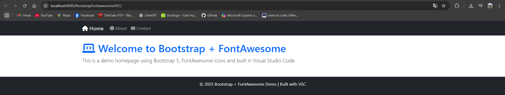
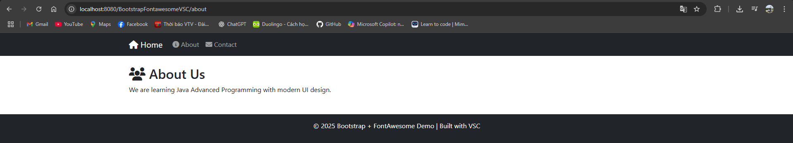
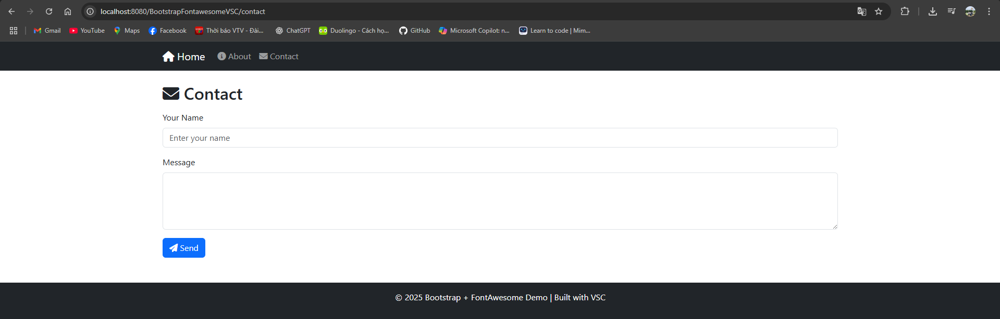

# Bootstrap-Fontawesome-VSC-JSP
Thiết kế giao diện bằng Bootstrap, Fontawesome và VSC

## Môn học: Lập trình Java nâng cao

### Công nghệ sử dụng
- Java Servlet/JSP (Jakarta EE 9)
- Bootstrap 5
- FontAwesome 6
- Visual Studio Code + Maven
- Tomcat 10/11

### Chức năng
- Trang Home, About, Contact
- Layout header/menu/footer tái sử dụng
- Giao diện responsive

### Cách chạy
1. Cài Maven, Tomcat 10+
2. Clone project:
```bash
git clone <repo-url>
cd BootstrapFontawesomeVSC
```
3. Chạy:
```bash
mvn clean package
```
4. Deploy file WAR lên Tomcat (webapps) hoặc dùng `Run on Server` trong VS Code/NetBeans.

### Demo Screenshot





---
